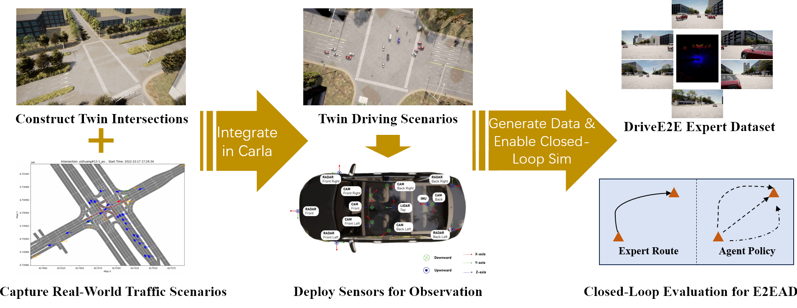

# DriveE2E: Closed-Loop Benchmark for End-to-End Autonomous Driving with Real-to-Simulation

</div>

<h3 align="center">
  arXiv | Demo |
  <a href="https://github.com/AIR-THU/DriveE2EX">Code</a>
</h3>



<br><br>

## Table of Contents:
1. [Highlights](#high)
2. [TODO List](#todos)
3. [License](#license)
4. [Citation](#citation)

## Highlights <a name="high"></a>

- DriveE2E is a simple yet challenging closed-loop evaluation framework, which closely integrates real-world driving scenarios into the CARLA simulator, effectively bridging the gap between simulated and real-world driving environments.

## TODO List <a name="todos"></a>
- [ ] Closed-loop simulator release
- [ ] Base-model configs & checkpoints
- [ ] Benchmark code release
- [ ] Benchmark configs & checkpoints


## License <a name="license"></a>

All assets and code are under the [Apache 2.0 license](./LICENSE) unless specified otherwise.

## Citation <a name="citation"></a>

Please consider citing our paper if the project helps your research with the following BibTex:

```bibtex
@inproceedings{yu2025_drivee2e,
 title={DriveE2E: Closed-Loop Benchmark for End-to-End Autonomous Driving with Real-to-Simulation}, 
 author={Haibao Yu and Wenxian Yang and Ruiyang Hao and Chuanye Wang and Jiaru Zhong and Ping Luo and Zaiqing Nie},
 booktitle={https://arxiv.org/abs/2509.23922},
 year={2025}
}
```
